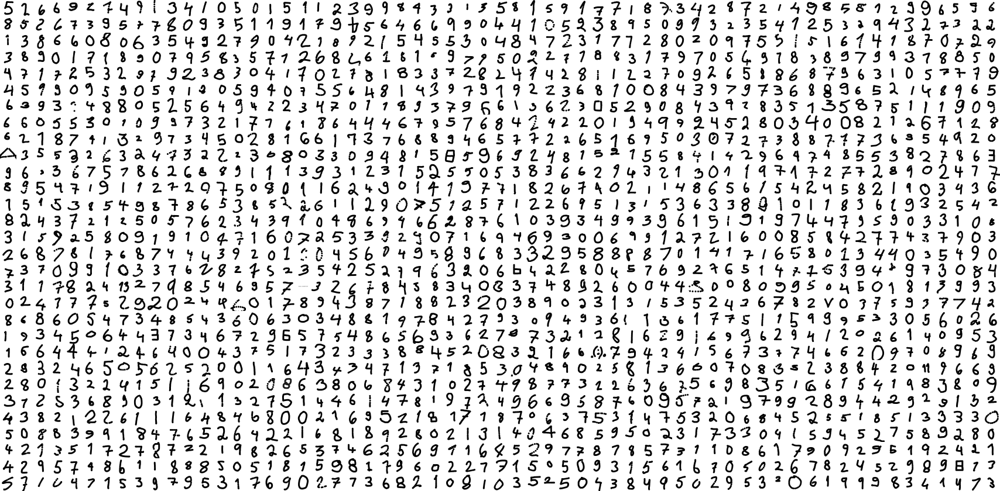

# Contributing

I encourage anyone to contribute to this project! Whether you're a beginner or an expert, there is something you can do. Don't worry about making mistakes, we are all learning!

### Something you could do:
- The dataset is still quite small for machine learning. **You can help me create a larger dataset** by drawing some digits with the [data generation app](https://joonasjokinen.fi/handwritten-digit-classification/datageneration). Even a few digits helps a lot!
- **Clean up dataset.** There are mislabelled digits and drawings that are not actual digits. If you have ideas on how to do it, let me know.
- I am a beginner programmer. If you have some time to **review the code**, don't hesitate to create an issue suggesting improvements or to improve the code yourself and create a pull request!

### Contributors

**The digits in the dataset were drawn by:**

11v, 5v, \@Olli78, A, Aapo, ak, Alanne S, Aleksei K, Aleksi, Alex, Anna, Anne, Anni B, Antti Merilehto, Anu, AR-, Arma, Arttu, asiannutija @ gmail.com, Astennuz, Atte, Azoth, brighttux, Charlotta, closet nerd :), cool, Disa, Distrobat, eeli l, Eetu Rantanen, Elfred, Elina H., Emil, EmiliaE, Emmu, Emty, Erkka, esa, Evani, G, gambina1557, h, Hanna S, Harri.kankaanpaa @ winnova.fi , Heidi, Heikki Pahnila, hjampe, homersimpson, HouBe , hxl, irreki, J0, Jaakko, Jaakko T, Janne, Janne O, Jari O, Jari Varjus, Jarkko Moilanen, Jarno Oravainen, Jenni, Jenny, JK, Johanna , Jonas Rajanto, Joni, Jonna, Jonne, Joonas, Joonas Hämäläinen, Lunanova Oy, Jounk, JS17, JT, JTLeskinen, Jukeboksi, Jukka, Julle, Jussi Aleksi Anno, Jussi R, JussiK, Jutta, JV, Jycce, Jyrki Kostilainen, jz, Kaisa, Kari Martikainen, Kata, KATJA, Katja, Katti, Kilroyr, Kim B, Kip, Kokoomusnuori, Komu, konola, KS, Lassi Mölsä, Lassi P, Laura-Maaria Penttilä , Lauri, LawlietNick, Leens, Lenni Laukkanen, Lestaatius Oli Ristitty Ihmii, LiisaP, LordIC, M, M., Maija, Mami, Marko O, Markus, Markus Valkama, Masta Niemelä, Mauno, Mervi, mh, Micke, Miia, Mika, Mika T, Mika Turunen, mikeful, Mikko, Mikko OJ, Mikko S, Mirde, MirjaA, Mirva, MLa, Mmm, Mr.Noise, Nanite, Nerdaxic, Niklas Piispanen, Niko, niko, Nina, ninnixcecilia, nokkaeläin, Nooa, noora, Noora, Numerojäbä, Olli Jernfors, Olli-Pekka Inget, Olo, Oona, Oskar, Outi, PAH, Pantter1, PanuV, Pauliina, Pauliina Murtola, Pauliina Pietilä, Pekkis, PetriP, Petrus, Petteri, Pia Klemetti, Piia Patronen, Poc, Pomppu-Jaska, Ppp, prs, Pörni, r, Rami Hirvelä, Rekku, Rick, Riina, Riku K, Roman, S. S., Saana, sadra, Salli , Sami, Sami Hakonen, Sandezu, Sari, Sari Toivonen, Sarita, SH, Siiri, simppalammas, Sini, Sini K, Snen, Suvi, sxrtu, takku, TanjaM, Taru, Taya, Tero, Tero Paajoki, Tero Valkiala, test, Tiekki, Tiia Sarell, Tiina , tiina , Timo Halttunen, Tomi, Tomi Hägg, TomiS, Tommi Partanen, Toni, Toni Asikainen, Tonisn, Topi, Tuire, Tuomas Keskinarkaus, Tuukka, Tuula Metsä , Vaasa Hacklab, Vellu, Venla, Viittakostaja, Viljanen , Ville Luukkonen, Ville Vaajanen, Vul, Winterroad

