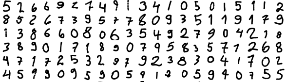

# Computer-Vision-Project

The purpose of this project was mostly to help me learn programming.

However, I encourage anyone to contribute to this project! See [CONTRIBUTING](CONTRIBUTING.md)

## Dataset

To create the dataset, I coded and published [a public web app](https://jnsjknn.github.io/handwritten-digit-classification/datageneration), where anybody can draw digits. The app posts the pixel data and the label to a [Google Cloud Firestore database](https://firebase.google.com/products/firestore/) I set up.

**The web app is still online and submitted digits are still occasionally being added to the dataset.**

The dataset has examples of handwritten digits. The data is in a JSON format. The file contains an array of objects, where each object has two fields:

* `image:` a 784-element array of numbers [0,255], representing pixel values for each 28x28 handwritten image. `255` means white and `0` means black.
* `label:`: the label for this character

### The current amount of digits in the dataset (28 November, 2019):

<table>
<tr><td><b>All</b></td><td>0</td><td>1</td><td>2</td><td>3</td><td>4</td><td>5</td><td>6</td><td>7</td><td>8</td><td>9</td></tr><tr>
<td><b>13942</b></td>
<td>1284</td>
<td>1441</td>
<td>1439</td>
<td>1376</td>
<td>1431</td>
<td>1357</td>
<td>1374</td>
<td>1465</td>
<td>1328</td>
<td>1447</td>
</tr></table>



### Using the dataset

Anyone is free to do anything they want with the dataset. You can either download it or use it with AJAX. An attribution is appreciated but not required.

##### Download

You can download the data [here](data/dataset.json)

##### AJAX

```javascript
let data;
(async () => {
  const URL = 'https://raw.githubusercontent.com/jnsjknn/handwritten-digit-classification/master/data/dataset.json'
  data = await fetch(URL).then(res=>res.json());
})()
// data becomes: Array(13942) [{...}, {...}, ..., {...}]
```

## The neural network

For now, the neural network is an almost exact copy of the Coding Train's [Toy Neural Network](https://github.com/CodingTrain/Toy-Neural-Network-JS) which uses stochastic gradient descent backpropagation. The neural network uses non-optimized functions which causes a lot of performance issues. Eventually, I may try switching to TensorFlow.js.

The neural network that is currently being used in the main app was trained with 60 epochs, each having 12547 digits from the dataset. Each digit was fed forward individually and the weights and biases were adjusted each time. Learning rate started at 0.01 and was divided by 2 every 5 epochs. Testing with the rest of the dataset (1392 digits), the network correctly predicted 77% of the labels.

## Credits

This project was immensely inspired by [Daniel Shiffman](https://github.com/CodingTrain) and particularily, his [Neural Networks Playlist on Youtube](https://www.youtube.com/playlist?list=PLRqwX-V7Uu6aCibgK1PTWWu9by6XFdCfh) on which my implementation is largely based on.

Thank you also to 3Blue1Brown for his [Youtube playlist](https://www.youtube.com/playlist?list=PLZHQObOWTQDNU6R1_67000Dx_ZCJB-3pi) which greatly helped me understand neural networks.
